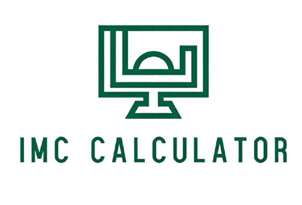

# Cálculo de IMC - Android

## Descrição Geral do Projeto
Aplicativo Android para cálculo do Índice de Massa Corporal (IMC).

## Aluno
Gabriel Carvalho Mota  
Estudante de Ciência da Computação - FECAP

## Processo de Desenvolvimento
O maior desafio foi enviar os dados entre as telas usando **Intent** e **Bundle**.
